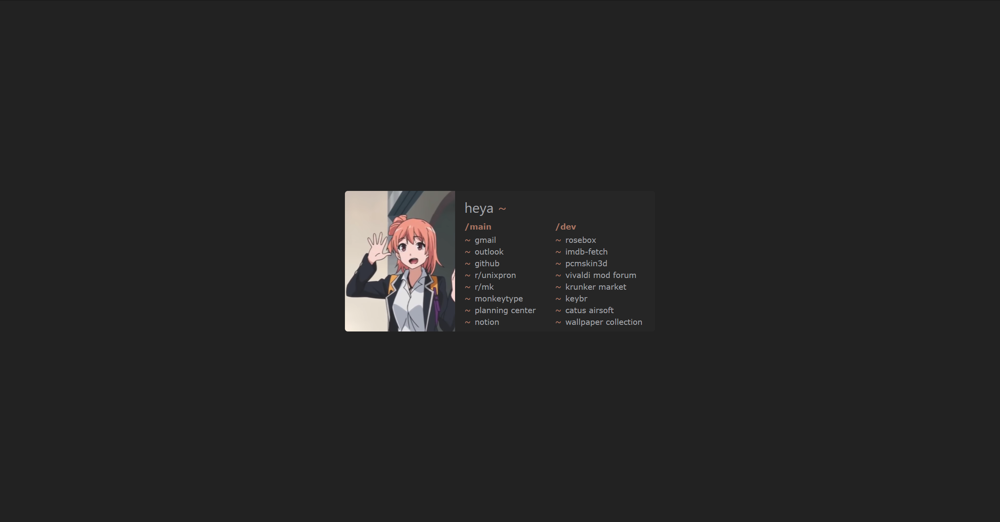
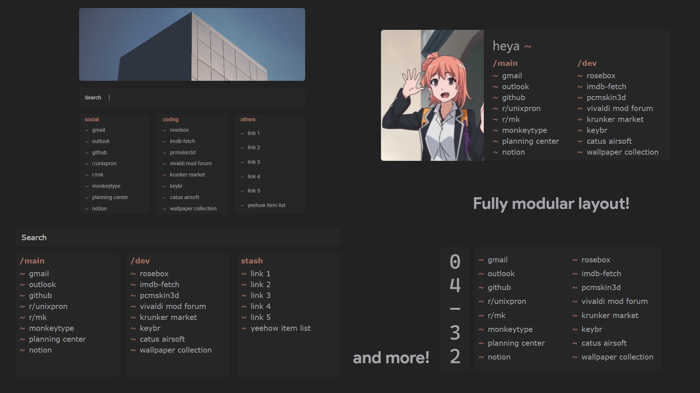
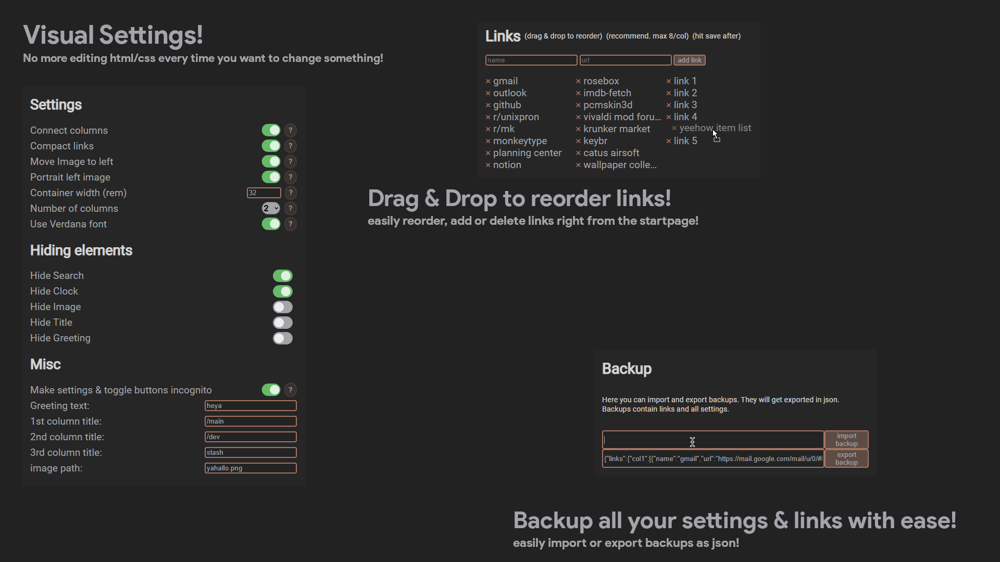

# glide
*a modular but comfy startpage for many scenarios*  
  

  
# features:
- fully modular layout! combine options to create your own unique startpage layout!  
- 2/3 columns, search, image, clock, category labels, greeting  
- drag and drop link editor! visual settings!
- image carousel option  
- [rosebox](https://github.com/KraXen72/rosebox) color scheme & ability to customize color scheme  
- saving to localstorage, importing and exporting of settings  
- instant load/startup *(looking at you, nightTab)*  
- click bottom right ◐ to toggle the visibility of the image  
- click bottom left ⚙ to open the settings popup 
  
### installation (chrome / chromium)
I included a simple ``manifest.json`` so you can import it as a chrome extension.  
just clone this repo and load unpacked extension. (you have to enable developer mode)    
  
you can also install this in firefox or any browser, just set the ``index.html`` to your new tab page / create an addon which replaces the new tab page with this ``index.html``

### custom images
if you want a custom image, put it in the ``img`` folder.
the image should be either a standard portrait image (good for left image) or a wide slice/landscape image (good for top image).   

After you put it in the img folder you can just change the image path in settings to the filename (don't add img/)
- custom css: you can create a `custom.css` to apply custom css (wow, unheard of)

### thanks to:
- [this startpage](https://github.com/WahyuHidayattz/startpage-new) for inspiration & original html/css boilerplate  
- image `floccinauci.jpg` - album cover of Floccinaucinihilipilification (feat. Grim Salvo)  
- images/reze screenshots from chainsawman, (lightly - heavily edited by me) found online  
- **i do not own most of the included images. I will provide credit/remove from the repo if requested.**
  
### libraries used:  
[object-observer](https://github.com/gullerya/object-observer/blob/main/src/object-observer.js) to automatically update layout when object changes - [repo](https://github.com/gullerya/object-observer)  
[sortablejs](http://sortablejs.github.io/Sortable/Sortable.js) to enable drag and drop reordering of links - [repo](https://github.com/SortableJS/Sortable)    
[circle-assign](https://github.com/hammy2899/circle-assign) to enable deep object assigning (i can't believe js does not have it by default)
[tinydate](https://github.com/lukeed/tinydate) super small date formatting library (modified to fit startpage's needs)
  
**commit history (before inital release here):** [commit history](https://github.com/KraXen72/startpage-new)